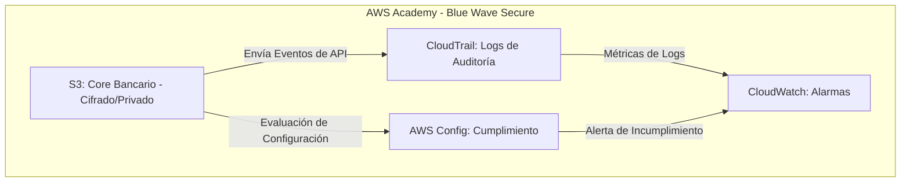

# Proyecto Cloud Secure: Fortalecimiento de la Fintech Blue Wave

Este repositorio contiene la implementación de controles de seguridad críticos para la infraestructura cloud de la fintech **Blue Wave** en AWS Academy. El objetivo principal es transformar una configuración vulnerable en un entorno robusto, auditado y conforme a las mejores prácticas de la industria.

---

## Arquitectura de Seguridad (Diagrama)

La solución implementa una estrategia de defensa en profundidad, asegurando que cada acción sea registrada y cada recurso esté vigilado:

Tienes razón, Jimmy. Aquí tienes el bloque específico de Markdown para la sección de "Controles de Seguridad Implementados", diseñado para que lo pegues directamente en tu README.md.

Este contenido destaca tu capacidad para aplicar el Módulo 9 en un entorno de misión crítica como la fintech Blue Wave.

## Controles de Seguridad Implementados
# 1. Protección de Datos (Amazon S3)
Se aplicó el Principio de Mínimo Privilegio sobre el almacenamiento del core bancario para garantizar la confidencialidad de la información:

Block Public Access: Restricción total de acceso desde internet a nivel de bucket y cuenta, eliminando vectores de ataque por exposición accidental.

Cifrado en Reposo (SSE-S3): Implementación de cifrado de servidor gestionado por AWS para asegurar que los datos estén protegidos físicamente en los discos.

Deny-by-Default: Configuración de políticas que aseguran que solo identidades autorizadas puedan interactuar con los activos financieros.

# 2. Auditoría Forense (AWS CloudTrail)
Se habilitó la trazabilidad total de la cuenta para cumplir con normativas de cumplimiento y auditoría técnica:

Registro de Eventos: Captura detallada de cada llamada a la API, identificando el "Quién", "Cuándo" y "Desde dónde" se realizó cada acción.

Integridad de Logs: Los registros se almacenan en un bucket de S3 dedicado, sirviendo como evidencia inmutable para procesos de auditoría forense.

# 3. Gobierno y Cumplimiento (AWS Config)
Implementación de auditoría automatizada para garantizar que la infraestructura mantenga su postura de seguridad en el tiempo:

Reglas de Cumplimiento: Uso de la regla s3-bucket-public-read-prohibited para monitorear en tiempo real que ningún recurso se desvíe de las políticas de seguridad.

Remediación y Visibilidad: Panel de control centralizado para identificar recursos "Non-Compliant" y facilitar una respuesta rápida ante configuraciones inseguras.

# 4. Monitoreo y Respuesta (Amazon CloudWatch)
Configuración de una capa de observabilidad proactiva para la detección temprana de anomalías:

Alarmas de Seguridad: Creación de umbrales y alertas automáticas ante cambios no autorizados en la infraestructura.

Métricas de Salud: Monitoreo constante del estado de los servicios críticos, asegurando la disponibilidad del sistema Blue Wave.
